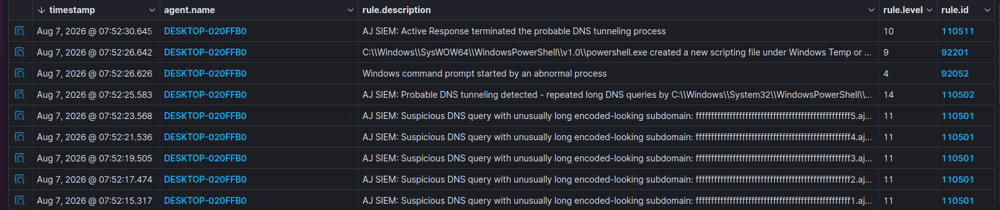
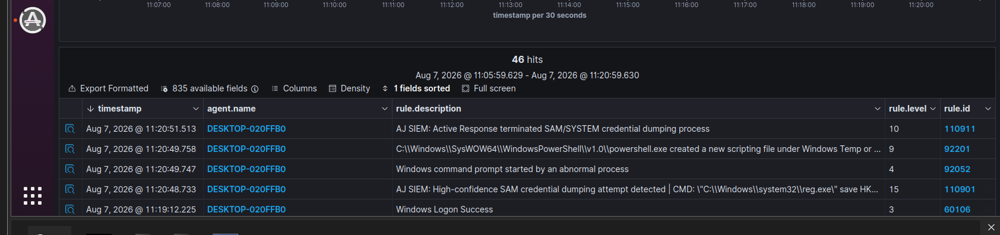
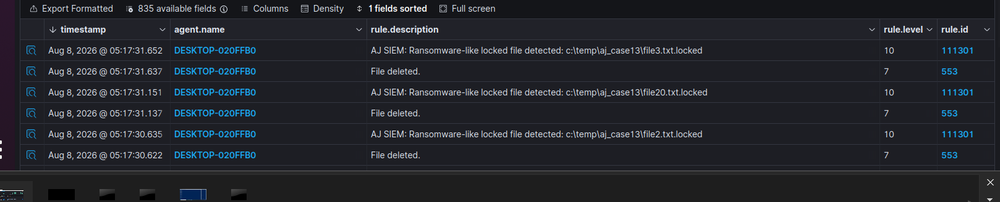

# AJ-SIEM-Homelab

A hands-on SOC/SIEM home lab built using Wazuh, Sysmon, Windows Event Logs, custom detection rules, Active Response, and MITRE ATT&CK mapping.

## Project Overview

This project was created to build practical experience in SOC operations, threat detection, incident response, log analysis, and detection engineering.

The lab includes 20 tested detection and response use cases across different attack techniques and security events.

## Technologies Used

- Wazuh SIEM/XDR
- Sysmon
- Windows Event Logs
- File Integrity Monitoring (FIM)
- Custom Wazuh Rules
- Active Response
- MITRE ATT&CK
- Threat Hunting
- Log Analysis
- Windows 10
- Ubuntu
- Kali Linux
- VMware Workstation

## SOC Workflow

Activity → Logs → Detection → Alert → Investigation → Response → Validation

## Project Goals

- Build realistic SOC detection scenarios
- Create custom detection rules
- Validate alerts using real logs
- Automate response actions
- Map detections to MITRE ATT&CK
- Improve Blue Team and Incident Response skills

## Disclaimer

This project was created for educational and lab purposes only.
All testing was performed inside an isolated virtual environment.

## Screenshots

### DNS Tunneling Detection & Active Response

### Credential Dumping Detection & Active Response

### Ransomware Detection

