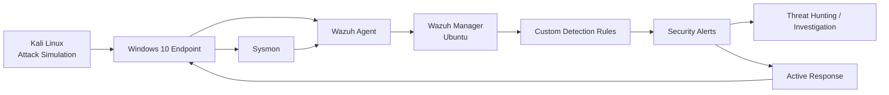

# AJ SIEM Lab Architecture

## Lab Components

- **Kali Linux** — Used to generate safe attack simulations and test traffic.
- **Windows 10 Endpoint** — Main monitored endpoint.
- **Sysmon** — Provides detailed Windows process, network, and system telemetry.
- **Wazuh Agent** — Collects and forwards endpoint security events.
- **Wazuh Manager** — Processes logs, applies detection rules, and generates alerts.
- **Custom Detection Rules** — Used for the 20 security detection use cases.
- **Active Response** — Executes automated containment and response actions.
- **Threat Hunting** — Used to investigate alerts and validate detections.

## Detection Flow

**Attack Simulation → Endpoint Telemetry → Wazuh Agent → Wazuh Manager → Detection Rule → Alert → Investigation / Active Response**
